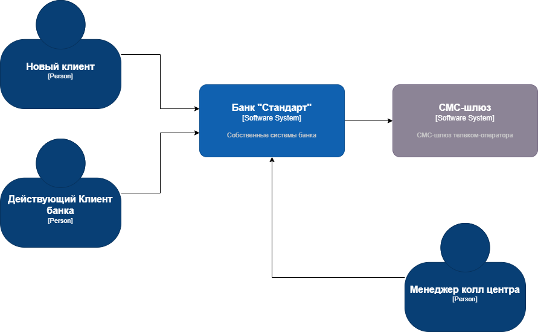
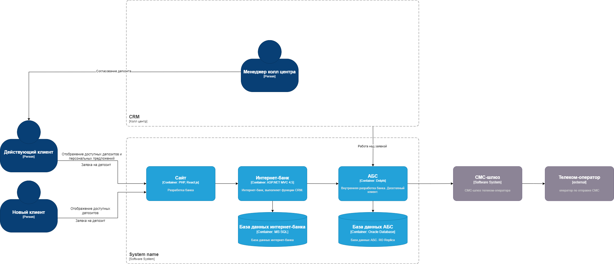

### **Открытие депозитов для MVP онлайн:** 
### **Автор: Колле В.А.**
### **Дата: 24.06.2025**
### **Функциональные требования**
| **№** | **Действующие лица или системы**                   | **Use Case**                    | **Описание**                                                                                               |
|:-----:|:---------------------------------------------------|:--------------------------------|:-----------------------------------------------------------------------------------------------------------|
|   1   | Новый клиент, Интернет-банк, АБС           | Отображение доступных депозитов | Потенциальный клиент видит список доступных депозитов с актуальными ставками                               |
|   2   | Действующий клиент, Интернет-банк, АБС                         | Отображение доступных депозитов | Клиент видит список доступных депозитов с актуальными ставками и персонализированные ставки лично для него |
|   3   | Новый клиент, Интернет-банк, АБС, СМС-шлюз | Заявка на депозит               | Новый клиент подает заявку на депозит, оставив свой номер телефона и Ф. И. О                       |
|   4   | Действующий клиент, Интернет-банк, АБС, СМС-шлюз               | Заявка на депозит               | Клиент подает заявку на открытие депозита указав счет и сумму депозита и подтверждает при помощи СМС кода                                    |
|   5   | Менеджер кол-центра, АБС, клиент          | Согласование заявки на депозит  | Менеджер согласовывает условия депозита                                     |
|   6   | АБС          | Расчет ставки по депозитам  | Создание нового функционала                                     |
### **Нефункциональные требования**

| **№** | **Требование**                                                                           |
|:-----:|:-----------------------------------------------------------------------------------------|
|   1   | Cервисы должны работать 24/7 и быть доступны в 99,9% случаев                             |
|   2   | Отклик по всем операциям должен занимать не более 1с                                  |
|   3   | Данные необходимо защищать с помощью механизма шифрования трафика, использовать TLS 1.2+ |
|   4   | Использовать технологии, которые уже есть в банке                                        |
### **Решение**

Для MVP будут использованы текущие технологии и инструменты которые уже есть в банке.
### **Альтернативы**
Переход на микросервисную архитектуру с асинхронными взаимодействиями c использованием Kafka и с возможностью горизонтального масштабирования системы АБС

**Недостатки, ограничения, риски**

Избежать прямой работы интернет-банка с API АБС в новом процессе
АБС может масштабироваться только вертикально из-за своей базы данных 
