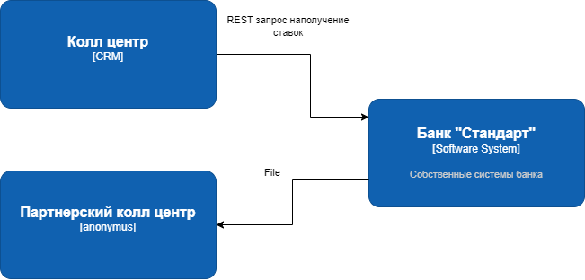
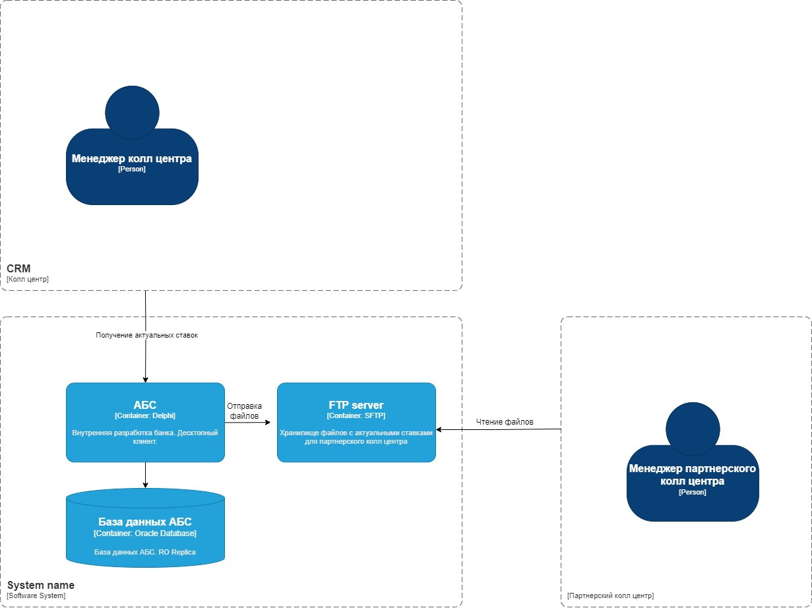

### **Передача ставок в кол-центр для MVP:** 
### **Автор: Колле В.А.**
### **Дата: 24.06.2025**
### **Функциональные требования**
| **№** | **Действующие лица или системы**                   | **Use Case**                    | **Описание**                                                                                               |
|:-----:|:---------------------------------------------------|:--------------------------------|:-----------------------------------------------------------------------------------------------------------|
|   1   | Сотрудник колл центра, колл центр, АБС           | Получение информации о текущих ставках банка | Сотрудник колл центра может видеть актуальные значения ставок банка для консультаций по телефону                               |
|  21   | Сотрудник партерского колл центра, партнерский колл центр, FTP сервер, АБС           | Получение информации для партенрского колл центра о текущих ставках банка | Сотрудник партнерского колл центра может видеть актуальные значения ставок банка для консультаций по телефону                               |

### **Нефункциональные требования**

| **№** | **Требование**                                                                           |
|:-----:|:-----------------------------------------------------------------------------------------|
|   1   | Взаимодействие между АБС и колл центром должно быть защищенное с помощью механизма шифрования                          |
|   2   | Взаимодействие между АБС и парнерским колл центром должно быть по протоколу SFTP                                  |
|   3   | Данные по ставкам должны быть актуальные |
|   4   | Колл центр должен иметь возможность выполнять повторные запросы в случае потери данных                                        |
|   5   | Партнерский колл центр должен иметь возможность выполнять повторное получение файла в случае потери данных или ошибки получения/чтения/распознования файла                                        |
### **Решение**

### **Альтернативы**
Переход на асинхронное взаимодействие при помощи Kafka. Уход от использования файлов. События от АБС отправляются без задержки. Колл центры получают новые данные без лага по времени

**Недостатки, ограничения, риски**

1. Данные в колл центрах могут обновляться только раз в сутки
2. Требуется выделение отдельного FTP для хранения файлов
3. Есть риск заполнения выделенной памяти на FTP, настройка ротации
4. Нужен контроль и мониторинг за сертификатами SFTP
5. Сложность контроля отработанных файлов
